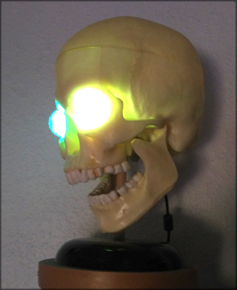

# netstat
A visual indication of internet connection status

## Abstract
This is a realtime display of what's going on with the internet in my house that's
inspired by a similar project that Emily Velasco published:

[Internet of Skull](https://mle-online.com/projects/internet_skull/index.html)

My version is based on a cheap ESP8266 devboard driving a pair of WS2812b LEDs.
Periodically it pings both Google (8.8.8.8) and my own router and lights up the
eyes various colors:
* Green - good connection to the router and Google
* Yellow - good connection to the router but not Google
* Red - no connection to the router, or WiFi is not connected.

Because the LEDs I used are capable of full RGB operation I've added a slow
"wobble" - the color shifts slightly back and forth between the left and right
eyes just to indicate that the processor is alive. There's also a normal LED
that blinks at a slow rate for heartbeat indication.

## Details
### Electronics
I used a Wemos D1 Mini board which provides a USB connector, supply regulation
and USB/Serial programming for the ESP8266 module. I used the thru-hole 5mm
package of the WS2812b LEDs mainly because those work well with the way the
eyeballs are constructed and soldered 4-conductor ribbon cable with 0.1" header
termination to connect to the ESP.

### Skull
The skull is a plastic model that I bought at a hobby store decades ago and had
been sitting on a shelf gathering dust for years. The top comes off and provides
a fine place to stash the electonics and there are convenient holes for the power
cord and the wiring to the eye sockets.

### Eyeballs
The eyeballs are 25mm glass spheres that were bought on ebay for a few dollars.
They have holes that fit 5mm LEDs perfectly and were filled with #11 clear glass
beads for diffusion. The LED was then hot-glued in place.

### Code
The included code "TickerNeo_netstat.ino" contains all the code that was needed
for this version. It uses the Adafruit Neopixel library to drive the eye color,
the Ticker library to periodically update the colors and the ESP8266 Arduino
support libs for the WiFi and ping functions.

